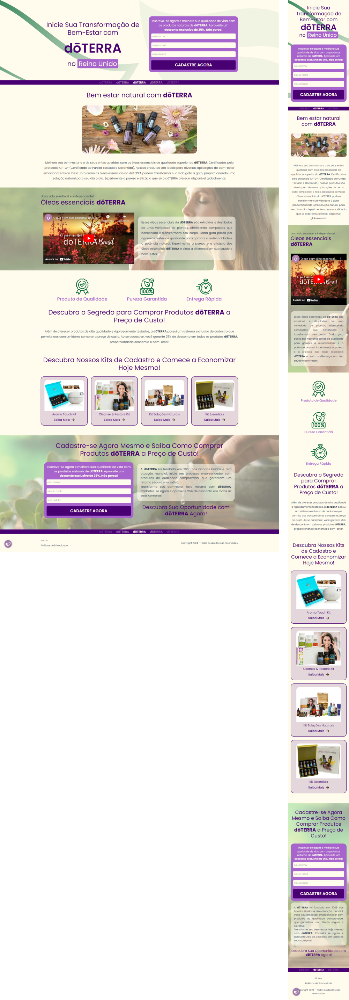

# I am from Earth: Discover the Power of Essential Oils

This project is a website dedicated to lead generation for a Brazilian team working with dōTERRA products in the United Kingdom, a global company specializing in high-quality essential oils. The site offers information about dōTERRA products as well as the opportunity to become an entrepreneur with the brand. Additionally, the site also features a detailed privacy policy and a thank-you page for new community members.

## Screenshots

  

## Access the online project

<a href="https://soudaterra.com" target="_blank">soudaterra.com</a>

## Tecnologias Utilizadas

-   HTML
-   CSS
-   SCSS

## Technologies Used

-   Visual Studio Code
-   Modern browsers for testing (Chrome, Firefox, Safari)

## Instalação

Clone the repository to your workspace.
Open the HTML files in the browser of your choice.

## Comandos

This project does not use npm run dev or npm start as it is based solely on HTML and CSS. However, if you want to add JavaScript-based functionalities in the future, you can use npm run dev for development and npm start for production.

## Contribuições

Contributions are welcome! Feel free to open an issue or make a pull request.

## Contato

-   Full Name: Matheus Torres
-   Email: mt@matheustorres.com
-   Website/Portfólio: https://matheustorres.com
-   Phone/WhatsApp: +44 07415 952646

I am eager to hear your impressions of this project. If you find anything unique or particularly captivating, please don't hesitate to share. I am fully available for an in-depth discussion on these points and open to collaborating on future projects.
